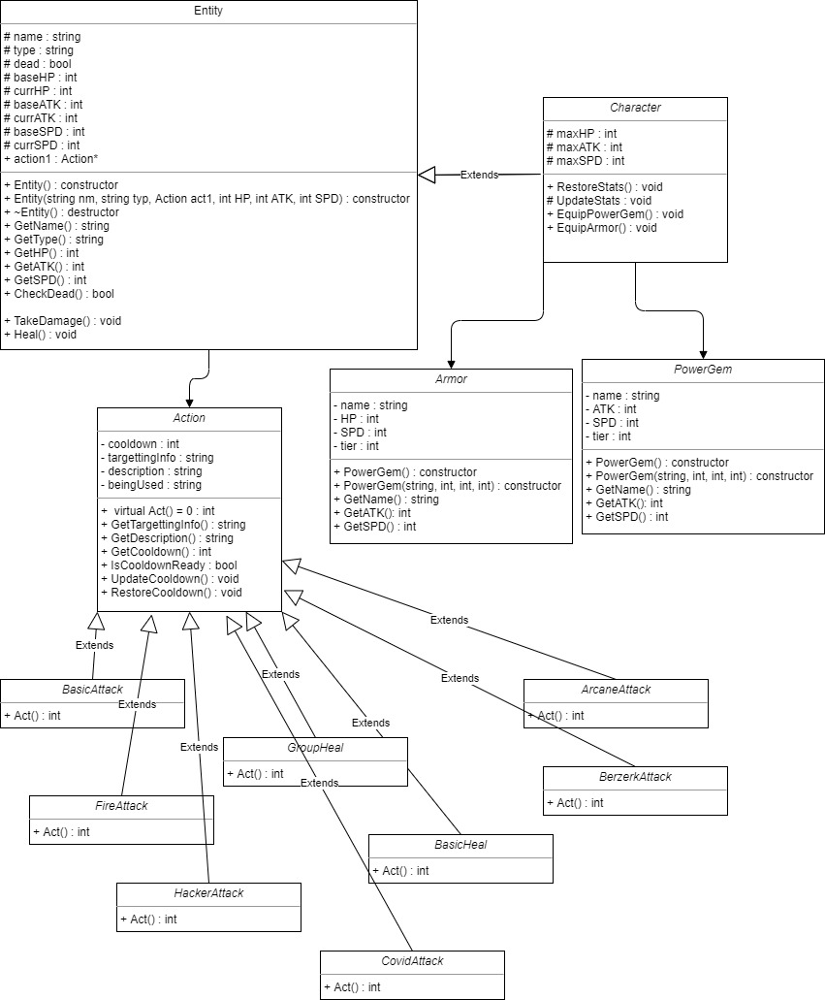
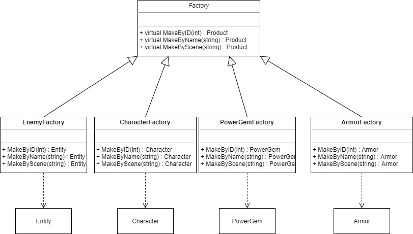
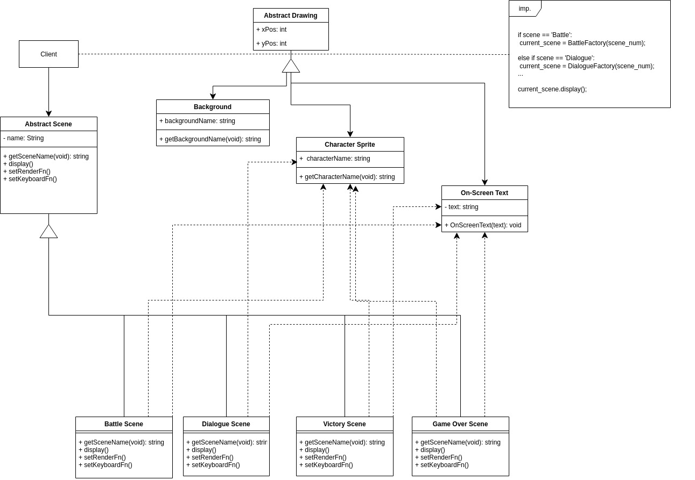

# Turn-Based RPG Game

 > Authors: [Krishaan Patel](https://github.com/kpate135), [Rany Tith](https://github.com/ranyishere), [Gabriel Ruelas](https://github.com/FeistierMage-Gabe)

## Project Description
* Why is it important or interesting to you?
  * Because games are fun
  * Turnased RPG's are fun
* What languages/tools/technologies do you plan to use?
  * OpenGL - graphics tool (GLUT library) - (GLUT is event driven)
  * C++11 - Language
* What will be the input/output of your project?
  * GLUT library will handle keyboard and mouse input events
  * GLUT will display changes to the user graphically
* What are the design patterns you will be using? 
   * Abstract Factory:
     * This chooses what kind of monster to spawn and the quantity. For example, if a user is within a specific region of the map then choose a monster that represents that region. This design pattern will allow us to keep track of how regions of the map interact with the quantity and type of monsters without producing redundant code.
  * Composite:
    * This will handle our basic class system in the game for both allies and enemies. We chose composite because it makes it easier to structure and maintain our ally and enemy class systems. Composite allows us to alter and handle various groups of characteristics shared between certain characters.
 
## Class Diagram

This showcases the internals of the player and enemy stats and their related interfaces to be used throughout our game. 
The ACTION class will be used with the strategy desgin pattern which will be used to choose which action algorithm to use when a player or enemy acts.

The Factory UML is showcasing the Factories we have planned for populating enemies (Entity) and allies (characters) as well as equipment which includes PowerGems and Armor.

The Abstract Scene acts as your abstract factory. There are four concrete factories: Battle Scene, Dialogue Scene, Victory Scene and Game Over Scene.
Each factory creates a Background, Character Sprite, and On-Screen text objects. In the UML diagram you can see how the factory is implemented on
the top right.

 > ## Final deliverable
 > All group members will give a demo to the TA during lab time. The TA will check the demo and the project GitHub repository and ask a few questions to all the team members. 
 > Before the demo, you should do the following:
 > * Complete the sections below (i.e. Screenshots, Installation/Usage, Testing)
 > * Plan one more sprint (that you will not necessarily complete before the end of the quarter). Your In-progress and In-testing columns should be empty (you are not doing more work currently) but your TODO column should have a full sprint plan in it as you have done before. This should include any known bugs (there should be some) or new features you would like to add. These should appear as issues/cards on your Kanban board. 
 
 ## Screenshots
 > Screenshots of the input/output after running your application
 ## Installation/Usage
 > Instructions on installing and running your application
 ## Testing
* For the Character code, we tested with google unit testing to make sure that everything worked as needed. For the state machine that run the battles and the loot system we simply started by randomly entering input to find various bugs (while keeping track of the input chain) to track down common bugs and fixing them. We then moved to methodical patterns that aimed at edge cases to find and fix bugs. Lastly, we used simple play tested to find bugs throughout the rest of the state machines.
 
